# Cascading Style Sheets (CSS)
##### Module Overview

In this module, we’ll start with a short tour of CSS. We’ll experiment with it through examples that explain its role and behavior. From there, we’ll dive deep into each technology, exploring concepts like CSS patterns to make our web pages look good. By the end of this module, we’ll be able to beautify our own web applications.

[Web.Dev](https://web.dev/learn/css)  [code](https://codepen.io/jonasschmedtmann/pen/LXydvq) [Flex-Game](https://flexboxfroggy.com/) [normalizeCss](https://www.dofactory.com/css/defaults) [Geniuse](https://caniuse.com/css-grid) [Colors](https://webgradients.com/) [ColorHunt](https://colorhunt.co/) [Color Shades and Tints](https://colors.artyclick.com/color-shades-finder/)

---
##### Module Objectives

- Learn how to use selectors to target specific web elements.
- Learn how to use CSS to style text and other web elements.
- Learn how to position web elements using CSS.
- Learn about the box model.
- Learn how to use the flexbox for positioning elements.

---
#### 1. What is CSS?
Or, How to Make Your Pages Look Pretty:
	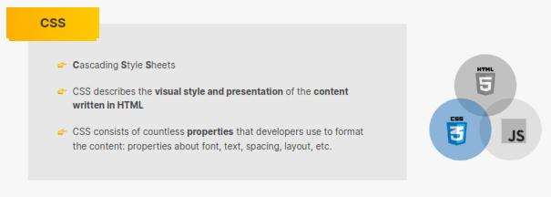
	
---

How can we customize the look and feel of our content?
One way is to use the `style` attribute on an HTML element:
```html
<html>
	<head>
		<title>Using the "style" HTML attribute</title>
	</head>
	<body>
		<p style="color:blue;">this text will be colore</p>
		<p style="color:blue;">this text will also be colore</p>
	</body>
</html>
```
The above approach would work just fine if working with a small number of elements. But once you’re dealing with large pages with lots of moving pieces, it will _quickly_ become extremely tedious to apply a separate `style` attribute to each element. In software development, we are often interested in reducing repetition. We can achieve this through the use of **Cascading Style Sheets**, or **CSS** for short. **CSS** specifically deals with the layout and customization of HTML elements.

##### Creating a CSS rule
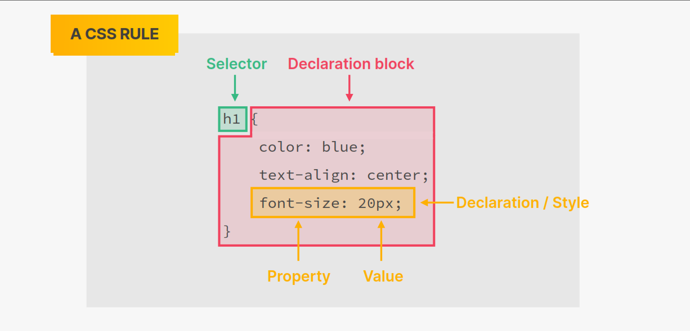
Let’s take a quick look at how we would take the previous example and apply the same style to the `p` elements using **CSS**:

Loading a separate CSS file into an HTML page can be accomplished by placing a `link` element within the `head`, like so:

```css
<link href="styles.css" rel="stylesheet" type="text/css">
```
- Exercise
	Use the `style` element to create a **CSS Rule** that makes an `h1` element’s text _ green _. Then add an `h1` element to your HTML page.
```HTML
<html>
	<head>
		<title> Exercise|Use CSS to Apply Style</title>
		<!-- Write Your CSS Here-->
	</head>
	<body>
		<!-- Write Your HTML Here-->
	</body>
</html>
```

#### 2. A Quick Look at CSS Selectors: Type Selectors
- The Element Selector
- The Class Selector
- The ID Selector
- Grouping Selectors
- Exercise
---

```html
<html>
	<head></head>
	<body>
		<h1 class="info">I am a header</h1>
		<p class="info">some vital info</p>
		<p id="warning">Don't do this!</p>
		<p class="info">some other vital info - really?</p>
		<p class="primary">Baisc texts</p>
	</body>
</html>
```

- What’s going on up there?
If you’ve written a lot of `html`, everything above should make some sense.
Some explanation wouldn’t hurt.
*Here we go:*
`Line 4` basically adds an `h1` header to the page.  
`Line 5` adds a paragraph with a `class` of `info`  
`Line 6` adds a paragraph too. This time, with an `id` of `warning`  
`Line 7` is pretty straightforward too. Can you figure that out? It says, _"Add a paragraph with a class of `info`"_  
`Line 8` also adds a paragraph to the page but with a class of `primary`
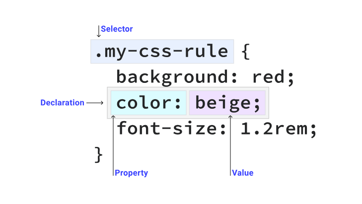
1. The Element Selector | Type selector :
	 A type selector matches a HTML element directly.
	 Below is an example: 
	```css
		p{
			color: #fff;
		}
	```
2. The Class Selector
	A HTML element can have one or more items defined in their `class` attribute. The class selector matches any element that has that class applied to it.
3. ID selector
	An HTML element with an `id` attribute should be the only element on a page with that ID value. You select elements with an  ID selector like this: 
	```CSS
	#rad {  border: 1px solid blue;}
	```
4. Grouping selectors
	A selector doesn't have to match only a single element. You can group multiple selectors by separating them with commas:
	
```CSS
strong,em,.my-class,[lang] {  color: red;}
```

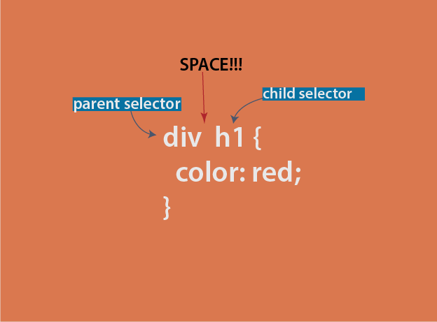
```html
<div>
	<h1>DIV: Header 1</h1>
	<h2>DIV: Header 2</h2>
</div>
<section>
	<h1>Header 1</h1>
	<h2>Header 2</h2>
</section>
```

```css
section h1,
section h2{
	color: blue;
}
```
5. Universal selector
	a Universal selector also known as a wildcard—matches any element. `*`
	```CSS
	* { 
		color: red;
	}
	```
6. Attribute selector
	You can look for elements that have a certain HTML attribute, or have a certain value for an HTML attribute, using the attribute selector. Instruct CSS to look for attributes by wrapping the selector with square brackets (`[ ]`).
```html
	<div data-type="primary"></div>
```

```CSS
	[data-type] {  color: red;}
	/********************************/
	
	/* A href that contains "example.com" */
	[href*='example.com'] { color: red; }
	/* A href that starts with https */ 
	[href^='https'] { color: green; }
	/* A href that ends with .com */
	[href$='.com'] { color: blue; }
	
	
```

---

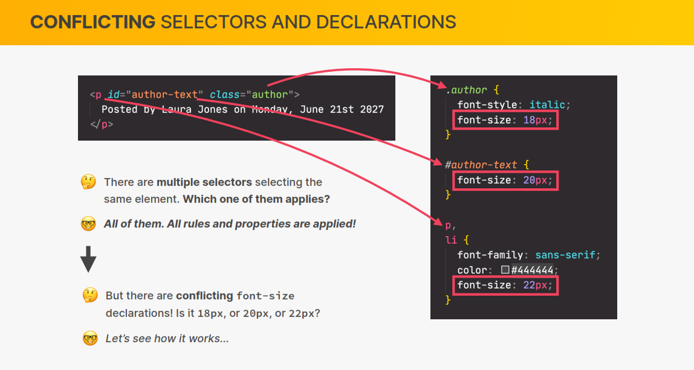

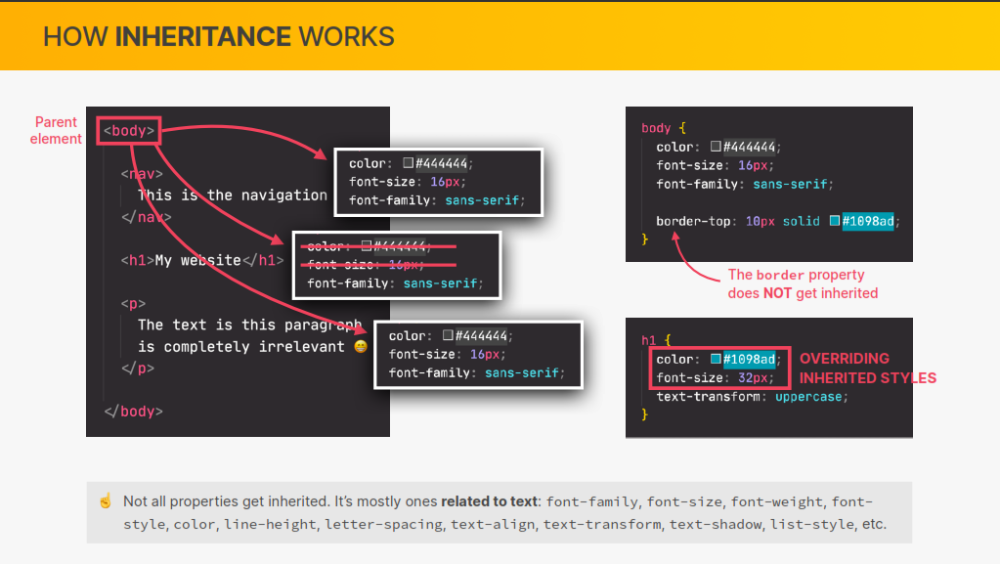

---
#### 3. CSS Selectors - again!
-  Pseudo-classes and pseudo-elements
	- So, what are Pseudo-class selectors
	==The pseudo-class selectors targets the selector, **in a specific state.**==

```html
<html>
	<head>
		<title>Descendant selectors</title>
	</head>
	<body>
		<a href="www.google.com">Click Me😁</a>
	</body>
</html>
```

```css
a:link{
	color:#0000ff;
}
a:visited{
	color:#ff00ff;
}
a:hover{
	color:#00ccff;
}
a:active{
	color:#ff0000;
}
```

In the example above `a:link` will target and style every `a` tag with an `href` attribute. i.e an `a` that contains a link.
	`a:visited` will target every anchor tag, `a` that has already been **visited** (clicked) on the page.
	`a:hover` will target every link as you **hover** over them
	Finally, `a:active` will style the link, just when you click on it. When it is **active**
	 ==The Order for Link Pseudo-Selectors==
	 In summary, the order in which you define these link pseudo-selectors is important. It should follow the order LVHA i.e `:link`, `:visited`, `:hover`, and finally `:active`
	 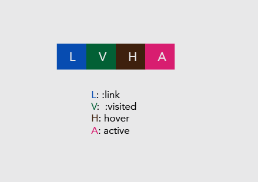
	- Other Pseudo-classes you should be aware of:
		- First Child:
			- In a much earlier example, we took a look at the parent child relationship in the html DOM. The selector, `first-child` says it all. It targets the first child of a specific element within the parent element.
			- An example is always great. Let’s see one.

```html
<!DOCTYPE html>

<html lang="en">
	<head>
	    <meta charset="UTF-8">
	    <title>A Simple Page</title>
	</head>
	<body>
	    <div>
	        <p>I am the first paragraph here</p>
	        <p>I am the second paragraph here</p>
	        <p>I am the third paragraph here</p>
	        <p>I am the last paragraph here</p>
	    </div>
	</body>
</html>
```

```css
div p:first-child{
	color:red;
}
```
 
	- Last Child:
			- The `:last-child` pseudo-class selector is the opposite of `:first-child`. While `:first-child` targets the first child, `:last-child` targets the last child.
```css
div p:last-child{
	color:red;
}

```
	
- Only Child:
			- The `:only-child` pseudo-class selector selects an element if it is the only child of it’s parent.

```html
<body>
    <ul>
        <li>Item one</li>
        <li>Item two</li>
        <li>Item three</li>
	   </ul>
	   <ul>
	       <li>lone poor child</li>
	   </ul>
</body>
```
- In the markup above, the `li` in the second `ul` is the **only child** element. It can be selected and styled accordingly, like so:
```css
li:only-child{
color:red;
}
```
- Nth Child:
			- Imagine that instead of using `first-child`, `last-child` or `only-child`, you can use `nth-child` .
			   “n” could be anything? 1,2, 3, 4 ..etc?

```html
<body>
    <ul>
        <li>Item one</li>
        <li>Item two</li>
        <li>Item three</li>
        <li>Item four</li>
        <li>Item five</li>
        <li>Item six</li>
        <li>Item seven</li>
    </ul>
</body>
```
- The first `li` may be selected like this:
			- The `nth-child` is smart to know that `1` meant the first child. You may change the numeric value to suit your cause.
```css
li:nth-child(1){
color:red;
}
```
- I could easily target every `odd` or `even` list item, `li` like this:
```css
li:nth-child(odd){
color:red;
}
```

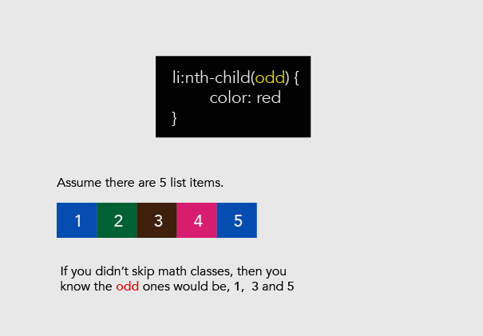
			The `nth-child` selector is smart enough to decipher the `odd` or `even` child elements.
		- Exercise:
			- **(a)** The `html` markup below should look familiar.
```html
<!DOCTYPE html>

<html lang="en">
	<head>
	    <meta charset="UTF-8">
	    <title>A Simple Page</title>
	</head>
	<body>
	    <div>
	        <p>I am the first paragraph here</p>
	        <p>I am the second paragraph here</p>
	        <p>I am the third paragraph here</p>
	        <p>I am the last paragraph here</p>
	    </div>
	    <div>
	  <p> Lone poor paragraph</p>
	    </div>
	</body>
</html>
```
- Todo
	1. Using `:first-child`, give the first paragraph a `color` of `red` and a `font-size` of `10px`
	2. 1. Using `:last-child`, give the last paragraph a `background-color` of `red` and a `color` of `white`
	3. 1. Using `:only-child`, give the ‘lone poor’ paragaph a `background-color` of `blue` and a `color` of `white`
#### 4. Best Practices for Selecting Elements:
- **1. Use type selectors when all or most instances of an HTML element needs to be styled in the same way.** 

```css
h1{
	color:blue;
}
```

- **2. Use classes to select elements that are more specific, reusable and flexible than type selectors.** 

```css
.red-letters{
	color:red; 
}
```

- **3. ID values can only be used once per page, so stick to using them for unique styles and global elements that are not repeated.**

```css
#my-element{
	color:teal;
}
```

- **4. For Pseudo selectors, try not to go more than three levels deep.**

```css
/* this looks good*/
div .red-letters{
	color:red;
}

/*this is too much*/

div .red-letters h1 p{
	color:red;
}
``` 

- It does work, but using more selectors may result in a slower page load because the browser has to cycle through each pattern.
#### 5. Selector Group Priorities:
- Six priority group rules for selectors:
	- To determine which selector has a higher priority, CSS divides the rules into six priority group from the highest to the lowest:
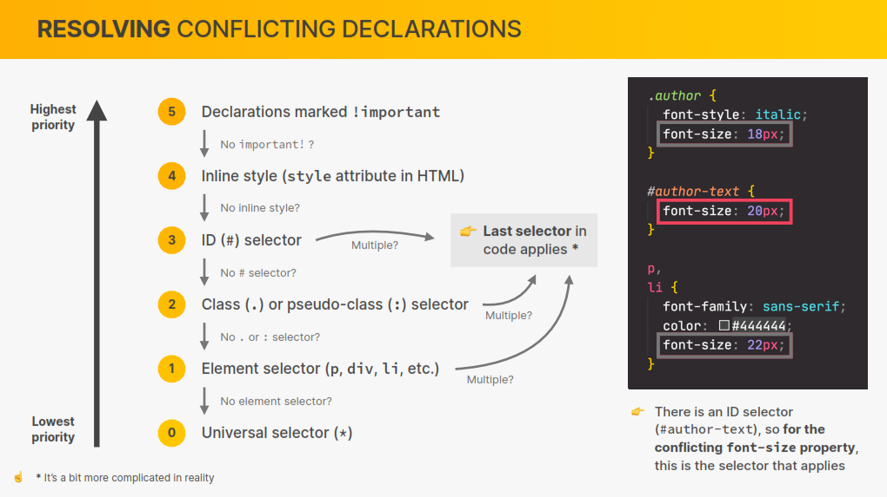
- 1. The **first priority** group contains rules with the `!important` modifier added to them. They override all rules that do not contain this modifier.
	```css
	p{
		color:blue !important;
	}
	```
	
- 2. The **second priority** group contains rules embedded in the style attribute of an HTML tag.
```html
<h1 style="color:green;">Heading</h1
```

- Even if you use the `h1 { color: red; }` rule, the following style attribute overrides it, and the heading will be shown in green:
- 3. The **third priority** group contains rules that have one or more **ID selectors**. 
- 4. The **fourth priority** group contains rules that have one or more class, attribute, or **pseudo-selector**.
- 5. The **fifth priority** group contains rules that have one or more element selectors.
- 6. And last, the **sixth (and lowest) priority** group contains rules that have only a **universal selector**.
---
#### 6. Making Sense of Units in CSS:
1. Pixels (px) ✔️
2. Points (pts)
3. Picas (pc)
4. Ems (em) = 16px ✔️
5. Rems (rem) = 16px✔️
6. Exes (ex)
7. Percentages (%)✔️
8. vmin and vmax
9. Viewport height (vh) and width (vw)✔️ 	 
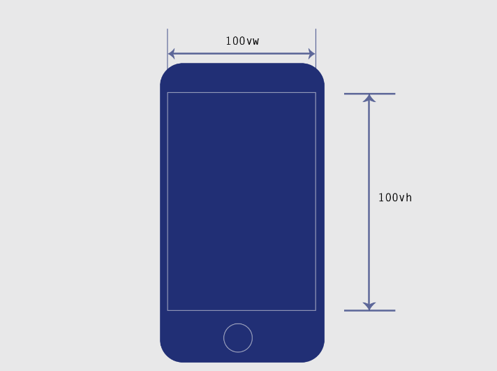

#### 7. The Box Model:

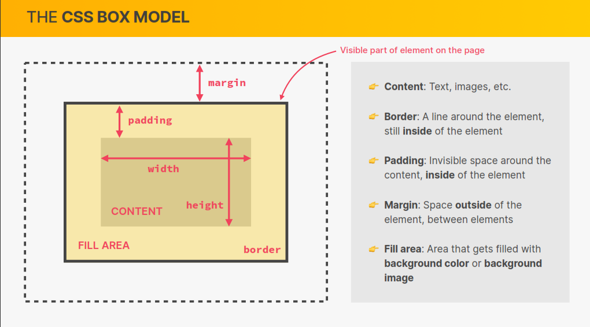
	
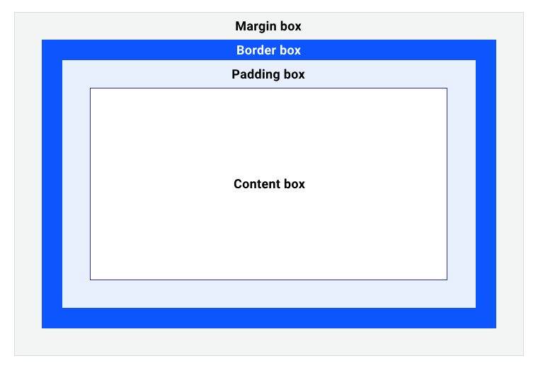

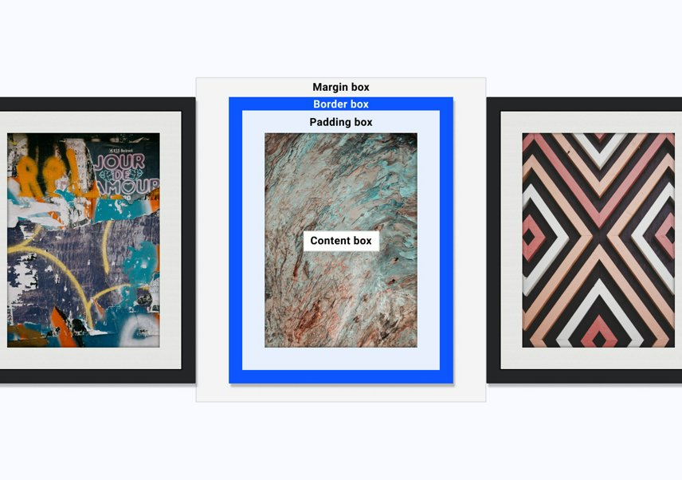

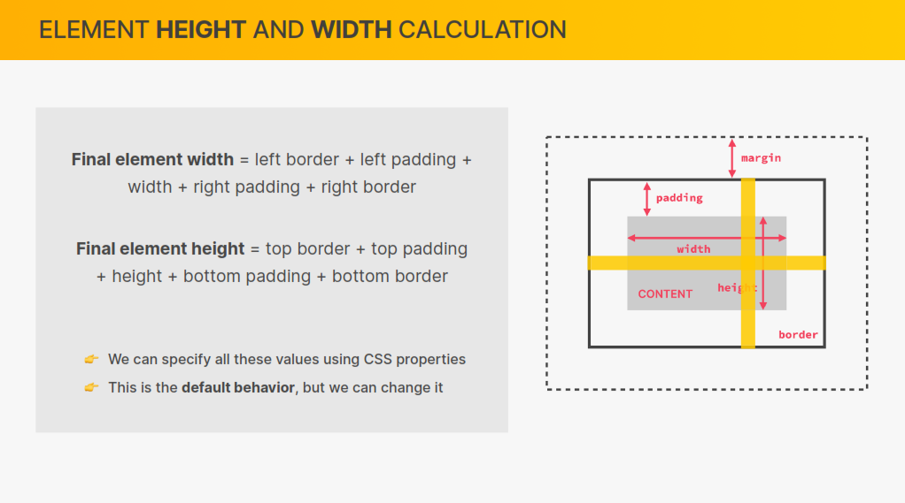
#### 8. Text:
- Text Alignment + Sizing
	- Use the `text-align` property to change the alignment of text within an element. `text-align` has four different values:
		1.  `center`: center the text
		2. `left`: align the text to the left of its container
		3. `right`: align the text to the right of its container
		4. `justify`: the text will spread out to fill out the full width of its container
```html
<!DOCTYPE html>
<html lang="en">
  <head>
    <title>Aligning Text</title>
  </head>
  <body>
    <h1 class="centered">A centered Heading</h1>
    <p class="leftAlign">
      Lorem ipsum dolor, sit amet consectetur adipisicing elit. Distinctio,
      omnis.
    </p>
    <p class="rightAlign">
        Lorem, ipsum dolor sit amet consectetur adipisicing elit. Voluptate, reiciendis?
    </p>
    <p class="justify">
        Lorem ipsum dolor sit amet consectetur adipisicing elit. Porro, eos!
    </p>
  </body>
</html>

```

```css
.centered{
	text-align: center;
}

.leftAlign{
	text-align: left;
}

.rigthAlign{
	text-align: right;
}

.justify{
	text-align: justify;
}
```

- Text Sizing:
	- to change the default size of text elements. The size of your text can be changed using the `font-size` property.
	   The `font-size` takes both absolute and relative values. The most common **absolute** value is `px`, and the most common **relative** values are `em`s and `rem`s.​

```html
<!DOCTYPE html>
<html lang="en">
  <head>
    <title>Text Sizing</title>
  </head>
  <body>
    <p class="small">Small Text</p>
    <p class="normal">Normal Text</p>
    <p class="big">Big Text</p>

    <div>
      <p class="small">Small Text</p>
      <p class="normal">Normal Text</p>
      <p class="big">Big Text</p>
    </div>
  </body>
</html>

```

```css
	div {
	  font-size: 200%;
	}
	.small {
	  font-size: 0.5em;
	}
	.normal {
	  font-size: 1em;
	}
	.big {
	  font-size: 3em;
	}
```

- Spacing text:
	- Use the `line-height` property to set the height of a line of text. 
```html
 <body>
    <p class="small">Small Text</p>
  </body>
```

```css
	.small {
	  font-size: 0.5em;
	  line-height:20px;
	}
```

- Font:
	- The `font-family` property specifies the font family that is to be used for the content of an element.
	-  Font Families
		- Based on the family specified, the browser will look up what font is available on the user’s Operating system and use that.
		- The more generic names that the CSS Specification allows are:
			1. serif
			2. sans-serif
			3. monospace
			4. cursive
			5. fantasy
- Font Tips You Should Know
	1. Generic font family names are keywords. Thus, they should **NOT** be quoted.  `font-family:sans-serif`
	2. Providing the generic font family name at the end of the list provides a fallback mechanism. i.e if the initial fonts specified aren’t available, there’s a fallback!
	3. Below are fonts you can feel confident using. i.e you can be sure the user has them installed. Pre-installed on their Operating System.
> 	**Windows:** _Arial, Lucida, Impact, Times New Roman, Courier New, Tahoma, Comic Sans, Verdana, Georgia, Garamond_
	
> 	**Mac:** _Helvetica, Futura, Bodoni, Times, Palatino, Courier, Gill Sans, Geneva, Baskerville, Andale Mono_

4. The list of fallback fonts is generally called a `font-stack`
5. Enclose font names in quotation marks, if they contain spaces. 
#### 8.Images and Gradients:
 - Getting started with Background Images:
	 - The `background-image` property
		The `background-image` property is the required property for setting a background image. It’s value is equal to `url()`. Where the `url` will hold the path to the image.
	
```html
<div class:"bg"></div>
```

```css
.bg{
	height:100vh;
	background-image:url("http://i.imgur.com/tBhfy0L.jpg");
}
```

- The Default Behaviour of Backgrounds:
		**1. By default, background images are repeated when they cannot fill up the available space.**
		**2. When backgrounds are repeated, they are repeated from left-to-right, and top-to-bottom.**
		**3. By default, if the image is too large, it gets cut off.**
		CSS is pretty smart.
- Sizing Background Images:
	- The `background-size` property is used to specify the size of background images.
		`div{background-size: 100% 50%;}`
		`div{background-size: 200px 150px;}`
		`div{background-size: 50% auto;}`
		`div{background-size: cover;}`
		`div{background-size: contain;}`
	 - Sizing Backgrounds Using Keywords:
	 `cover` will **cover** the entire space required while keeping the aspect ratio of the image. Most times this will suffice.
	 `contain` will **contain** the entire image within the space required. If more space is left, the background will be repeated.
	> The great thing is, on resizing your browser, the background image will be dynamically updated too.
- Gradients:
	- So, what is a [gradient](https://webgradients.com/)?
		Generally speaking, a gradient is a graduated blend between two or more colors . 
		 `background-image: linear-gradient(45deg, #ff9a9e 0%, #fad0c4 99%, #fad0c4 100%);`
		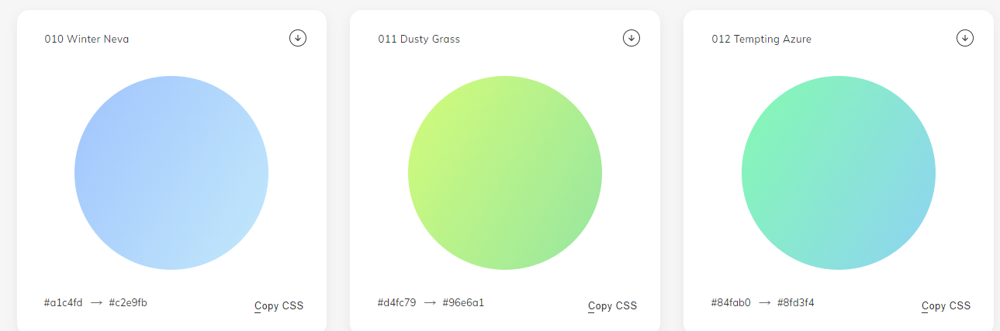
	- Types of Gradients:
		- Linear gradients `linear-gradient(yellow, red)`
		- Radial gradients  `linear-gradient(angle/direction, yellow, red)`
			- The available keywords include: `to top`, `to bottom`, `to right` and `to left`.
		==use case== :
		` background: linear-gradient(rgba(192,57,43 ,0.8), rgba(44,62,80 ,0.8)),url("http://i.imgur.com/tBhfy0L.jpg") 0% 0%/cover no-repeat `
#### 9. Layout:
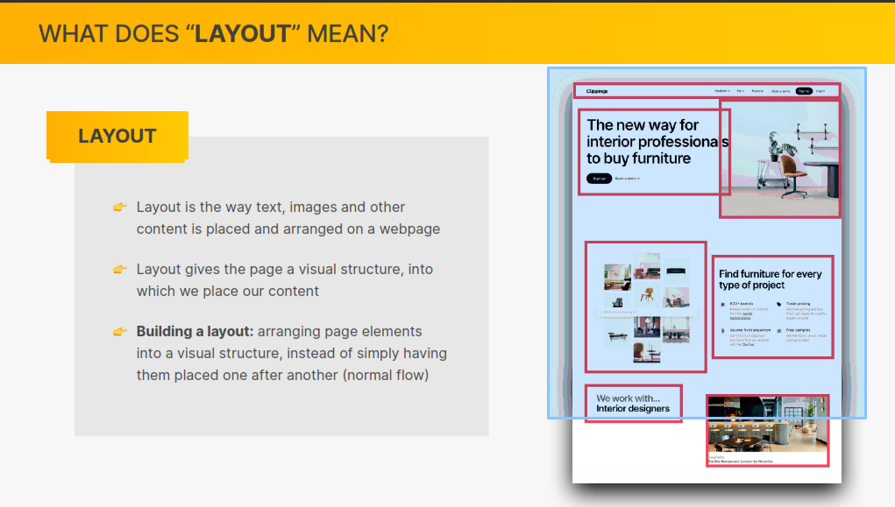

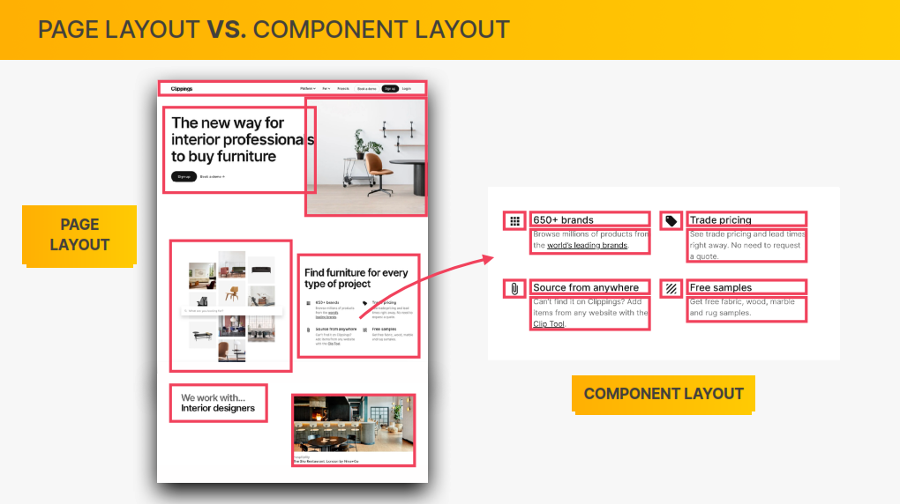

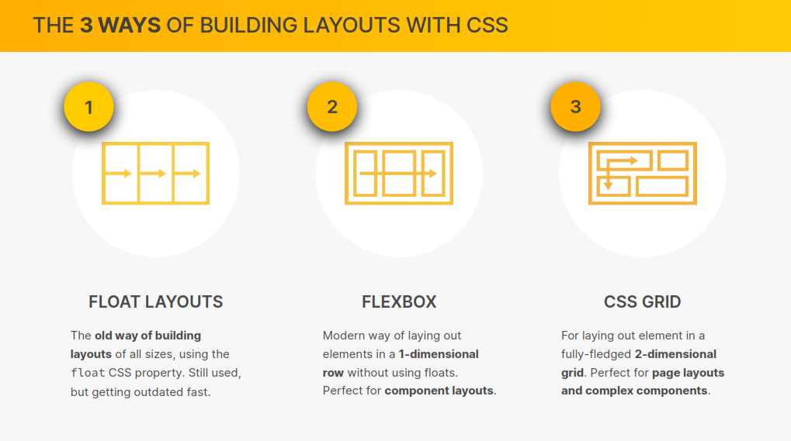
#### 10. Flexbox:
 - Introduction to Flexbox:
	 According to the specification, the flexbox model provides for an efficient way to layout, align, and distribute space among elements within your document, even when the viewport and the size of your elements is dynamic or unknown.
 - The Flex Container Properties:
	 Having set a parent element as a flex container, a couple of alignment properties are made available to be used on the flex container.
Just like you’d define the width property on a block element as `width: 200px`, there are 6 different properties the flex container can take on.
  1. Flex-direction:
		 The `Flex-direction` property controls the direction in which the flex-items are laid along the **main axis**.
```css
/*where ul represents a flex container*/
ul{
 flex-direction: row|| column || row-reverse || column reverse;
}
```

 In layman’s terms, the `flex-direction` property let’s you decide how the flex items are laid out. Either _“horizontally”_, _“vertically”_ or _“reversed”_ in both directions.
		In layman’s terms again, the main-axis’ default direction feels like _“horizontal.”_ From left to right.
		The cross-axis feels like “vertical.” From top to bottom.
		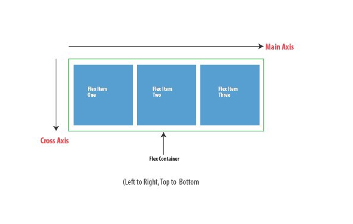
  2. Flex-wrap:
```css
/*where ul represents a flex container*/
ul{
	 flex-wrap: wrap || nowrap || wrap-reverse;
}
```

  Again, the flex container adapts to fit all children in, even if the browser needs to be scrolled horizontally.
		  This is because the `flex-wrap` property defaults to `nowrap`. This causes the flex container to NOT wrap.
		  “Wrap” is a fancy word to say, “when the available space within the flex-container can no longer house the flex-items in their default widths, break unto multiple lines.
	3. Flex-flow:
		The `flex-flow` is a shorthand property which takes flex-direction and `Flex-wrap` values.
```css
ul{
 flex-flow:row wrap; /*direction 'row' and yes, pleas wrap the items*/
}
```

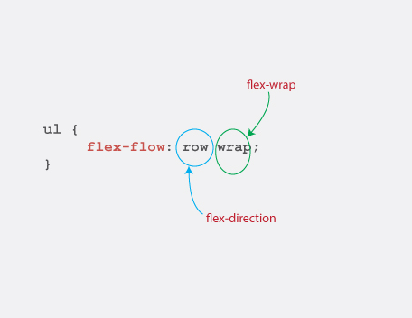	
	4. Justify-content
		Life’s really good with the Flexbox 😎.
		 If you still doubt that, the `justify-content` property may convince you.
		The `justify-content` property takes on any of the 5 values below.
```css
ul{
	justify-content: flex-start || flex-end || center || space-around || space-between;
}
```

- (i) Flex-start
		  The default value is `flex-start.`
		  `flex-start` groups all flex-items to the _start_ of the main axis.

```css
 ul{
            display: flex;
            justify-content: flex-start;
            border: 1px solid red;
            padding: 0;
            list-style:none;
            background-color: #e8e8e9;
        }
        li{
            background-color: #8cacea;
            width: 100px;
            height: 100px;
            margin: 8px;
            padding: 4px;
        }
```

  - (ii) Flex-end:
			  - `flex-end` groups the flex-items to the **end** of the main axis.
		  - (iii) Center:
			`Center` does just what you’d expect. It centers the flex items along the main axis.
		- (iv) Space-between:
			`Space-between` keeps the same space between each flex item.
			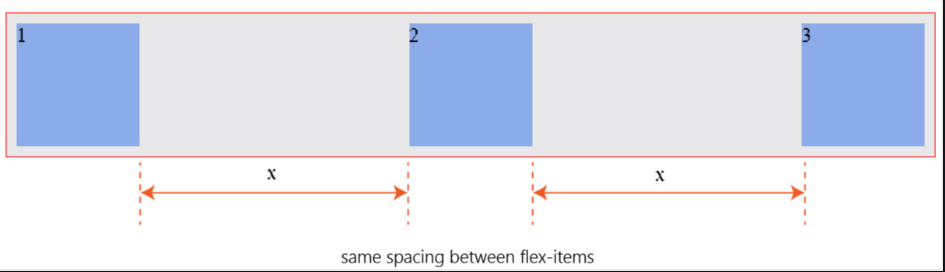
		- (v) Space-around:
			Finally, `space-around` keeps the same spacing around flex items.
			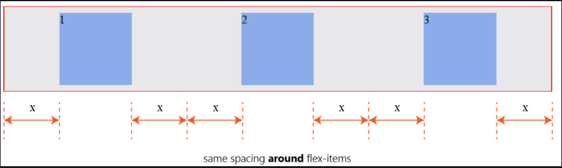
	5. Align-items:
		The `align-items` property is somewhat similar to the `justify-content` property.
		`Align-items` can be set to any of these values: `flex-start || flex-end || center || stretch || baseline`.
		
```css
ul{
	align-items: flex-start || flex-end || center || stretch || baseline ;
}
```		
