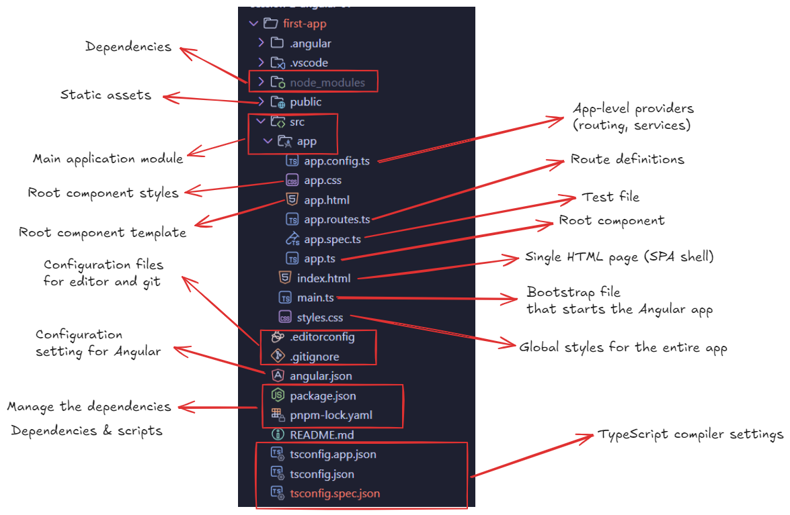
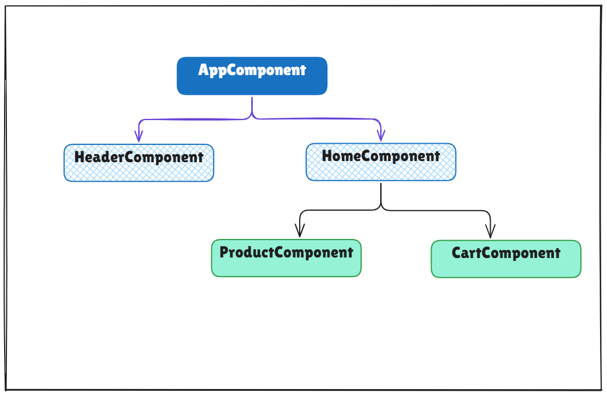
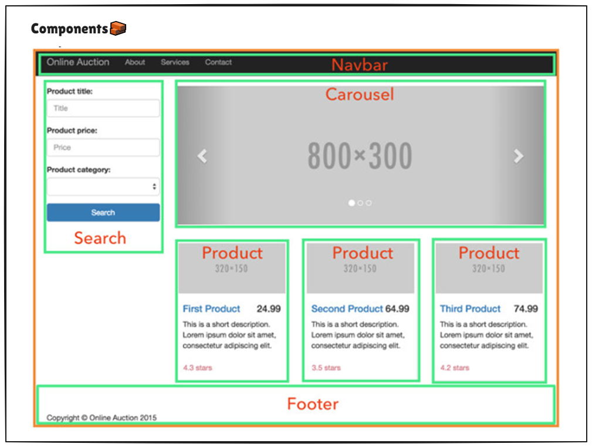
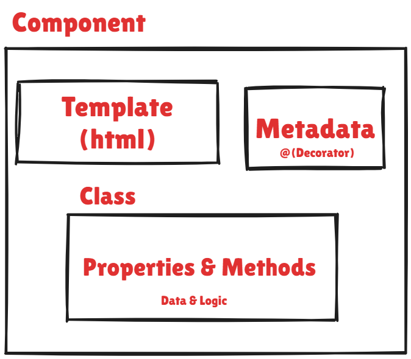
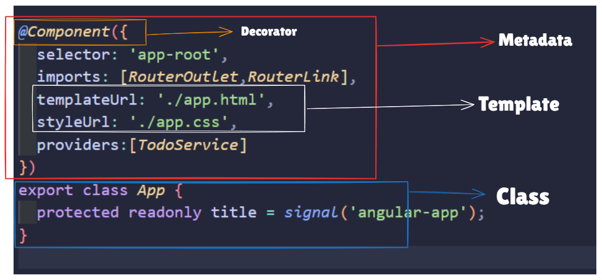
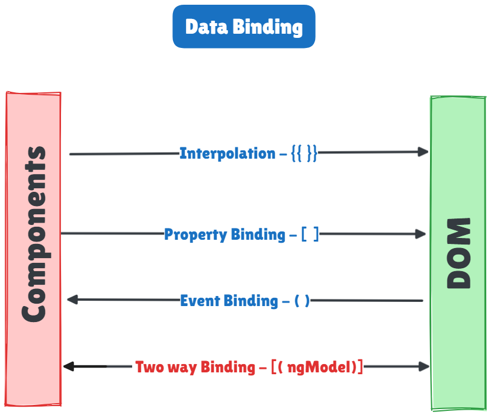
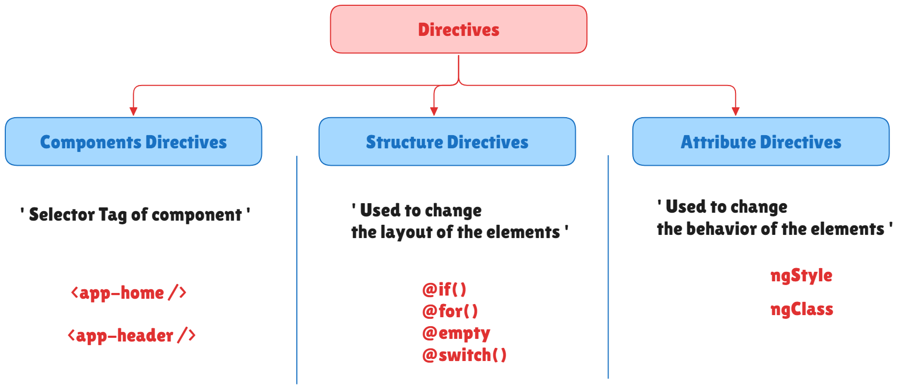
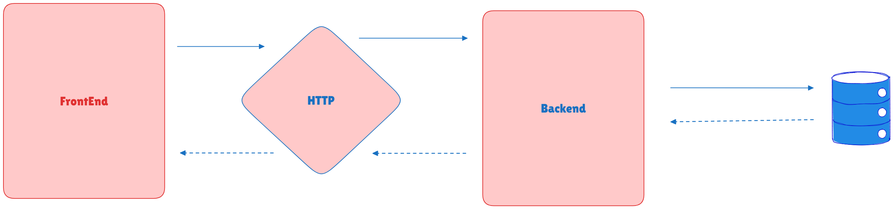

# Angular Framework Essentials
## Syllabus
- [ ] Introduction to **Angular**
- [ ] let's Build your first Angular app
- [ ] Angular Structure project
- [ ] Components
- [ ] Templates, Interpolation and Directives
- [ ] Data Binding & Pipes
- [ ] Nested Components
- [ ] Component lifecycle
- [ ] Services & Dependency Injection
- [ ] Retrieving Data using HTTP
- [ ] Dealing with Forms
- [ ] Navigation and Routing

---
## Session-5-Introduction to Angular

1. Angular intro
2. Angular setup
3. Angular files
4. SPA technique / concept
5. Angular architecture
6. Project flow
7. Install `bootstrap` & `fontawesome`
---
### Angular Intro:
 Angular is a web framework based on Typescript it's  allow us to create SPA , dynamic web application  rely on client side develop by google.
it's have a lot of libraries to helpful on development area as like as handle API, Validation, Testing, DOM.

- AngularJS *vs* Angular 2 
- Angular CLI
- Angular Routing
---
### Angular Setup
#### Setup Your Local development environment

>[!NOTE] This step is only for your local environment!

1. **NodeJS**
	Angular requires an active LTS or maintenance LTS version of Node. Let's confirm your version of `node.js`.
	From a **Terminal** window:
    1. Run the following command: `node --version`
    2. Confirm that the version number displayed meets the requirements.
 2. **PNPM** | NPM Package Manager   -  [[use-pnpm- with-angular-CLI]] 
	 1.  `npm i -g pnpm`
	 2.  `pnpm -v`
3. **Angular CLI**
	- With `node.js` and `npm` installed, the next step is to install the [Angular CLI](https://angular.dev/tools/cli) which provides tooling for effective Angular development.
	- From a **Terminal** window run the following command: `npm install -g @angular/cli`.
	- `ng config -g cli.packageManager pnpm`
4. Install integrated development environment (IDE) :
	1. **VS Code** 
		1. Add Angular Language Service  extension
	2. WebStorm 
	3. Optional: set-up your AI powered IDE

---
### let's Build your first Angular app

```cmd
ng new first-app
---
ng generate component home
# or shorthand
ng g c home

```

---
### SPA Technique 
#### How Do Traditional Web Applications Work?
 
 
 When you click on a link in a traditional web app, here’s what happens:

1. The browser makes an HTTP request to the server.
2. The server processes the request and responds with a new HTML page.
3. The entire page reloads, losing context of what the user was doing.


#### Limitations of Traditional Web Applications

- **Slow User Experience**: Frequent page reloads make the interaction less smooth.
- **Increased Server Load**: The server has to serve full HTML pages repeatedly.
- **Less Fluid Navigation**: There’s always a noticeable delay between actions and responses.

---
#### What is the SPA technique 🤔

The general idea is that we **control the number of requests sent to the server** to manage the number of request and the number of refreshes that occur, which is achieved by the server sending each HTML file once with the first request.


SPAs offer a modern, smooth, and efficient way of building web applications, especially when using Angular. With features like client-side routing, lazy loading, and operators for handling asynchronous events, Angular empowers developers to create high-performing SPAs.


#### Benefits of SPA Over Traditional Web Apps

- **Speed**: SPAs load content dynamically, providing faster responses.
- **User Experience**: Smooth, app-like transitions without full-page reloads.
- **Efficiency**: SPAs minimize the number of requests sent to the server, which reduces the load.
#### Advantages and Disadvantages of Single Page Applications
---
##### Advantages of SPAs
1. Speed and Performance
2. Improved user experience
3. Single Page
4. Reduced load time
5. Reduced server load

##### Disadvantages of SPAs
1. Not great for SEO
2. Security issues : Cross-Site Request Forgery (CSRF) | Cross-Site Scripting (XSS)
3. Won't work without JavaScript
4. Heavy usage of browser resources
5. Possible memory leaks
6. Poorly-optimized code
---

### Angular File Structure
#### Description
Components are the building blocks of Angular applications, encapsulating the template, logic, and styles to define a self-contained unit of the user interface.



Based on `first-app` project, here's the structure breakdown:
#### Root-level files

**Configuration files**
- **`angular.json`** – Angular CLI workspace config (build, serve, test settings for all apps/libs)
- **`package.json`** – npm/pnpm dependencies, scripts (`start`, `build`, `test`)
- **`tsconfig.json`** – Base TypeScript compiler options for the workspace
- **`tsconfig.app.json`** – TypeScript config for the application code
- **`tsconfig.spec.json`** – TypeScript config for test files
- **`.editorconfig`** – Code style rules (indentation, line endings) for editors
- **`.gitignore`** – Files/folders Git should ignore (`node_modules`, `dist`, etc.)

 **IDE helpers**
- **`.vscode/`** – VS Code workspace settings
  - `extensions.json` – Recommended extensions
  - `launch.json` – Debug configurations
  - `tasks.json` – Build/serve tasks

 `src/` – Application source code
##### Entry point
- **`main.ts`** – Bootstrap file that starts the Angular app
  ```typescript
  bootstrapApplication(App, appConfig)
  ```
  Loads the root component (App) with config.

- **`index.html`** – Single HTML page (SPA shell)
  - Contains `<app-root>` where Angular mounts the app

- **`styles.css`** – Global styles for the entire app

 `src/app/` – Main application module

Your app uses **standalone components** (modern Angular 18+ approach, no `NgModule`).
##### Core files
- **[app.ts](cci:7://file:///d:/Kareem%20Khater/NTG-Summer-Training/Shrouk-Trainning-2026/session-2-angular-01/first-app/src/app/app.ts:0:0-0:0)** – Root component
  ```typescript
  @Component({
    selector: 'app-root',
    imports: [RouterOutlet],
    templateUrl: './app.html',
    styleUrl: './app.css'
  })
  export class App {
    protected readonly title = signal('first-app');
  }
  ```
  - `selector` – HTML tag (`<app-root>`)
  - `imports` – Other components/directives used in template
  - `templateUrl` – HTML template file
  - `styleUrl` – Component-scoped CSS
  - `signal()` – Reactive state (Angular 18+ signals)

- **`app.html`** – Root component template 
- **`app.css`** – Root component styles
- **`app.spec.ts`** – Unit tests for [App](cci:2://file:///d:/Kareem%20Khater/NTG-Summer-Training/Shrouk-Trainning-2026/session-2-angular-01/first-app/src/app/app.ts:3:0-11:1) component (Jasmine/Karma)

##### Routing & config
- **`app.routes.ts`** – Route definitions
  ```typescript
  export const routes: Routes = [];
  ```
  Add routes like:
  ```typescript
  { path: 'home', component: HomeComponent }
  ```

- **[app.config.ts](cci:7://file:///d:/Kareem%20Khater/NTG-Summer-Training/Shrouk-Trainning-2026/session-2-angular-01/first-app/src/app/app.config.ts:0:0-0:0)** – Application-level providers
  ```typescript
  export const appConfig: ApplicationConfig = {
    providers: [
      provideBrowserGlobalErrorListeners(),
      provideZoneChangeDetection({ eventCoalescing: true }),
      provideRouter(routes)
    ]
  };
  ```
  - `provideRouter(routes)` – Enables routing
  - `provideZoneChangeDetection` – Change detection strategy
  - Add services, HTTP client, etc. here

`public/` – Static assets
- **`favicon.ico`** – Browser tab icon
- Put images, fonts, JSON files here (copied as-is to `dist/`)

 `node_modules/` – Dependencies
- Installed packages (Angular, TypeScript, dev tools)
- Never commit this (in `.gitignore`)

`dist/` – Build output (created after `ng build`)
- Production-ready files (HTML, JS bundles, CSS)
- Deploy this folder to a web server

---

### Typical workflow

#### Add a new component
```bash
ng generate component hello
# or shorthand
ng g c hello
```
Creates:
- `src/app/hello/hello.ts`
- `src/app/hello/hello.html`
- `src/app/hello/hello.css`
- `src/app/hello/hello.spec.ts`

Import it in [app.ts](cci:7://file:///d:/Kareem%20Khater/NTG-Summer-Training/Shrouk-Trainning-2026/session-2-angular-01/first-app/src/app/app.ts:0:0-0:0):
```typescript
import { HelloComponent } from './hello/hello';

@Component({
  selector: 'app-root',
  imports: [RouterOutlet, HelloComponent], // ← add here
  ...
})
```

#### Add a service
```bash
ng g service data
```
Creates `src/app/data.service.ts`. Provide it in [app.config.ts](cci:7://file:///d:/Kareem%20Khater/NTG-Summer-Training/Shrouk-Trainning-2026/session-2-angular-01/first-app/src/app/app.config.ts:0:0-0:0):
```typescript
providers: [
  DataService, // ← add here
  provideRouter(routes),
  ...
]
```
#### Add a route
In `app.routes.ts`:
```typescript
import { HelloComponent } from './hello/hello';

export const routes: Routes = [
  { path: '', redirectTo: '/home', pathMatch: 'full' },
  { path: 'home', component: HelloComponent },
];
```

In `app.html`, add `<router-outlet></router-outlet>` to render routed components.

---


### Angular Architecture

Angular follows a **component-based architecture** with clear separation of concerns. Here's the conceptual model and how it maps to your project.

####   **component-based architecture**
- *Component tree:*


- **Example**



- **Component Core Blocks**
**Structure:**
- **Class** – TypeScript logic (state, methods)
- **Template** – HTML view
- **Styles** – CSS (scoped to component)
- **Metadata** – `@Component` decorator



- **Example**



#### Component: 
- Scalable
- Reusable
- Selector `<Custom HTML Tag>`

---

### Key differences: Standalone vs NgModule

Your app uses **standalone** (modern):
- No `app.module.ts`
- Each component declares its own `imports: [...]`
- Providers go in [app.config.ts](cci:7://file:///d:/Kareem%20Khater/NTG-Summer-Training/Shrouk-Trainning-2026/session-2-angular-01/first-app/src/app/app.config.ts:0:0-0:0)

**Old NgModule style** (pre-Angular 14):
- `app.module.ts` with `@NgModule({ declarations, imports, providers })`
- All components declared in one place

---
### Summary

| File/Folder                                                                                                                                                        | Purpose                                 |
| ------------------------------------------------------------------------------------------------------------------------------------------------------------------ | --------------------------------------- |
| `src/main.ts`                                                                                                                                                      | App entry point                         |
| `src/index.html`                                                                                                                                                   | HTML shell                              |
| [src/app/app.ts](cci:7://file:///d:/Kareem%20Khater/NTG-Summer-Training/Shrouk-Trainning-2026/session-2-angular-01/first-app/src/app/app.ts:0:0-0:0)               | Root component                          |
| [src/app/app.config.ts](cci:7://file:///d:/Kareem%20Khater/NTG-Summer-Training/Shrouk-Trainning-2026/session-2-angular-01/first-app/src/app/app.config.ts:0:0-0:0) | App-level providers (routing, services) |
| `src/app/app.routes.ts`                                                                                                                                            | Route definitions                       |
| `angular.json`                                                                                                                                                     | CLI build/serve config                  |
| `package.json`                                                                                                                                                     | Dependencies & scripts                  |
| `tsconfig.*.json`                                                                                                                                                  | TypeScript compiler settings            |
| `public/`                                                                                                                                                          | Static assets                           |

---
### Install `bootstrap` & `fontawesome`
- [Angular Bootstrap Document](https://ng-bootstrap.github.io/#/getting-started)

```cmd
ng add @ng-bootstrap/ng-bootstrap
```

- [Angular Fontawesome](https://www.npmjs.com/package/@fortawesome/angular-fontawesome#angular-fontawesome)

```cmd
pnpm add @fortawesome/angular-fontawesome

ng add @fortawesome/angular-fontawesome@<version>
```
[Daisyui](https://daisyui.com/docs/install/)

---
## Session-6

- Template
- Interpolation
- Data Binding
- Directives
- Pipes
---
### Templates
Inline, linked

- Inline
```ts
import { Component } from '@angular/core';
import { CurrencyPipe, DatePipe, TitleCasePipe } from '@angular/common';
@Component({
  selector: 'app-root',
  imports: [CurrencyPipe, DatePipe, TitleCasePipe],
  template: `
    <main>
       <!-- Transform the company name to title-case and
       transform the purchasedOn date to a locale-formatted string -->
<h1>Purchases from {{ company | titlecase }} on {{ purchasedOn | date }}</h1>
	    <!-- Transform the amount to a currency-formatted string -->
      <p>Total: {{ amount | currency }}</p>
    </main>
  `,
})
export class ShoppingCartComponent {
  amount = 123.45;
  company = 'acme corporation';
  purchasedOn = '2024-07-08';
}
```

- linked
```ts
@Component({
  selector: 'app-home',
  imports: [],
  templateUrl: './home.html',
  styleUrl: './home.css',
})
export class Home {

}
```
---
### Interpolation
```ts
title : string = 'Hello from dark side.'
```

```html
<h2> {{ title }} </h2>
```

---
### Data Binding
- one way (Property binding, Event binding, Interpolation) 
- two way `[(ngModel)]="''"` | banana in a box

---
### Directives



The different types of Angular directives are as follows:

| Directive Types                                                                            | Details                                                                           |
| :----------------------------------------------------------------------------------------- | :-------------------------------------------------------------------------------- |
| [Components](https://angular.dev/guide/components)                                         | Used with a template. This type of directive is the most common directive type.   |
| [Attribute directives](https://angular.dev/guide/directives#built-in-attribute-directives) | Change the appearance or behavior of an element, component, or another directive. |
| [Structural directives](https://angular.dev/guide/directives/structural-directives)        | Change the DOM layout by adding and removing DOM elements.                        |

---
#### 1. Component Directives
Components are directives with templates. They're the building blocks of Angular applications.
	as like as a `Router` `Sevices` ,   is a components directive.
**Key Points:**
- Defined with `@Component` decorator
- Must have a template (inline or external)
- Can have their own styles
- Can receive data via `@Input()` and emit events via `@Output()`

**Example:** 
```typescript
@Component({
  selector: 'app-product',
  template: `<h2>{{title}}</h2>`,
  styles: [`h2 { color: blue; }`]
})
export class ProductComponent {
  @Input() title: string = '';
}
```

#### 2. Structural Directives
Change the DOM layout by adding or removing elements. They're prefixed with `*`.

##### @if()
Conditionally renders content.

**Syntax:**
```html
@if (condition) {
  <!-- Content to show when condition is true -->
}
```

**Example:**
```html
@if (item.isActive) {
  <button>Add to Cart</button>
}
```

##### @else
Optional block that renders when the `@if` condition is false.

**Example:**
```html
@if (item.isActive) {
  <button>Add to Cart</button>
} @else {
  <button disabled>Out of Stock</button>
}
```

##### @for()
Repeats a template for each item in a collection.

**Syntax:**
```html
@for (item of items; track item.id) {
  <!-- Template to repeat -->
}
```

**Example:**
```html
@for (product of products; track product.id) {
  <div>{{product.name}}</div>
}
```

##### @switch()
Similar to JavaScript's switch statement.

**Syntax:**
```html
@switch (expression) {
  @case (value1) { ... }
  @case (value2) { ... }
  @default { ... }
}
```

**Example:**
```html
@switch (product.status) {
  @case ('in-stock') {
    <span>In Stock</span>
  }
  @case ('out-of-stock') {
    <span>Out of Stock</span>
  }
  @default {
    <span>Check Availability</span>
  }
}
```

#### 3. Attribute Directives
Change the appearance or behavior of an element, component, or another directive.
- ngStyle and ngClass
**Key Points:**
- Defined with `@Directive` decorator
- Don't have templates
- Can listen to host element events
- Can modify DOM properties

 **Step 1:** Generate the Directive
```cmd
ng generate directive highlight --skip-tests
```

**Step 2:** Implement the Directive Logic
```typescript
import { Directive, ElementRef, HostListener, Input } from '@angular/core';

@Directive({
  selector: '[appHighlight]',
  standalone: true
})
export class HighlightDirective {
  // Default color is yellow
  @Input() appHighlight: string = 'yellow';
  // Optional default color when not hovering
  @Input() defaultColor: string = 'transparent';

  constructor(private el: ElementRef) {}

  // When mouse enters the element
  @HostListener('mouseenter') onMouseEnter() {
    this.highlight(this.appHighlight);
  }

  // When mouse leaves the element
  @HostListener('mouseleave') onMouseLeave() {
    this.highlight(this.defaultColor);
  }

  // Helper method to change the background color
  private highlight(color: string) {
    this.el.nativeElement.style.backgroundColor = color;
  }
}
```

**Step 3:** Use the Directive in a Component
- **Option 1:** In a standalone component
```ts
import { Component } from '@angular/core';
import { HighlightDirective } from '../directives/highlight.directive';

@Component({
  selector: 'app-product',
  standalone: true,
  imports: [HighlightDirective],  // Import the directive
  templateUrl: './product.html',
  styleUrls: ['./product.css']
})
export class ProductComponent {
  // Component logic here
}
```

- **Option 2:** In a module (if not using standalone)
```ts
import { HighlightDirective } from './directives/highlight.directive';

@NgModule({
  declarations: [
    // other components
    HighlightDirective  // Add the directive to declarations
  ],
  // ...
})
export class AppModule { }
```

**Step 4:**  Use the Directive in Your Template
```html
<!-- Using default color (yellow) -->
<p appHighlight>Hover over me!</p>

<!-- Custom highlight color -->
<p [appHighlight]="'lightblue'">I'll be light blue on hover</p>

<!-- With default color (transparent when not hovering) -->
<p [appHighlight]="'lightgreen'" defaultColor="transparent">
  Green on hover, transparent by default
</p>
```

---
##### 1. ngStyle

`ngStyle` lets you set multiple inline styles dynamically.

###### Basic Syntax:
```html
<element [ngStyle]="{'styleName': 'value'}">
```
###### examples:
```html
<!-- Single style -->
<p [ngStyle]="{'color': 'red'}">Red text</p>

<!-- Multiple styles -->
<p [ngStyle]="{
  'color': textColor,
  'font-size.px': fontSize,
  'font-weight': isBold ? 'bold' : 'normal'
}">Dynamic styles</p>

<!-- Using component method -->
<p [ngStyle]="getTextStyles()">Styled text</p>
```

##### 2. ngClass

`ngClass` adds/removes CSS classes dynamically.
###### Basic Syntax:
```html
<element [ngClass]="{'className': condition}">
```
###### Example:
```html
<!-- Single class -->
<p [ngClass]="'highlight'">Highlighted text</p>

<!-- Multiple classes with conditions -->
<p [ngClass]="{
  'text-danger': hasError,
  'text-success': !hasError && isActive,
  'special': isSpecial
}">Conditional classes</p>

<!-- Array of classes -->
<p [ngClass]="['text-uppercase', 'fw-bold']">Uppercase and bold</p>
```

---
#### Key Differences:

| Type       | Changes DOM | Has Template | Example              |
| ---------- | ----------- | ------------ | -------------------- |
| Component  | Yes         | Yes          | `<app-product>`      |
| Structural | Yes         | No           | `*ngIf`, `*ngFor`    |
| Attribute  | No          | No           | `ngStyle`, `ngClass` |

#### Best Practices:
1. Use components for reusable UI elements
2. Use structural directives for conditional rendering or repeating templates
3. Use attribute directives for DOM manipulation and behavior
4. Prefer the new control flow (`@if`, `@for`, `@switch`) over `*ngIf`, `*ngFor` in new code
5. Keep directive logic focused and simple

#### Recap: 
1. Component directive
2. Structure directive
	- @if()
	- @else
	- @empty
	- @for()
	- @switch()
		- @case()
		- @defualt
3. Attribute directive
	- `ngClass`
	- `ngStyle`

---
### Pipes
- **Pipes** transform data in templates for display purposes, such as formatting dates, numbers, or filtering and sorting lists.


[Pipe](https://angular.dev/guide/templates/pipes)

---


## Session-7

- Services & DI
- Routing
- Nested Routing
---
### 1. Services & Dependency Injection

**Concepts to cover:**

- What a service is: a class that holds reusable logic (data access, calculations, shared state) instead of putting everything inside components.  
- Why services: separation of concerns, easier testing, and sharing logic across multiple components.  
- Dependency Injection (DI): Angular’s way to create and provide instances of services to components and other services.  
- Providers and scopes:  
  - `providedIn: 'root'` (singleton app-wide).  
  - Providing in a component (new instance per component subtree).  

**Creating a Service:**
```typescript
// user.service.ts
import { Injectable } from '@angular/core';

@Injectable({
  providedIn: 'root'  // Singleton service available app-wide
})
export class UserService {
  private users = [
    { id: 1, name: 'Ahmed', email: 'ahmed@example.com' },
    { id: 2, name: 'Sara', email: 'sara@example.com' },
    { id: 3, name: 'Mohamed', email: 'mohamed@example.com' }
  ];

  getUsers() {
    return this.users;
  }

  getUserById(id: number) {
    return this.users.find(user => user.id === id);
  }
}
```
**Injecting the Service:**

```typescript
// user-list.component.ts
import { Component, OnInit } from '@angular/core';
import { UserService } from './user.service';

@Component({
  selector: 'app-user-list',
  template: `
    <h2>Users</h2>
    <ul>
      <li *ngFor="let user of users">
        {{ user.name }} - {{ user.email }}
      </li>
    </ul>
  `
})
export class UserListComponent implements OnInit {
  users: any[] = [];

  // Inject service via constructor
  constructor(private userService: UserService) {}

  ngOnInit() {
    this.users = this.userService.getUsers();
  }
}
```
**Modern inject() Function (Angular 14+)**

```typescript
import { Component, OnInit, inject } from '@angular/core';
import { UserService } from './user.service';

@Component({
  selector: 'app-user-list',
  template: `...`
})
export class UserListComponent implements OnInit {
  // Field initializer injection
  private userService = inject(UserService);
  users: any[] = [];

  ngOnInit() {
    this.users = this.userService.getUsers();
  }
}
```
  
**Exercise idea:**

- Create a `UserService` that returns a list of users (hardcoded).  
- Inject it into two different components and display the same data.  
- Ask: “What changed if we move the provider from root to one component?”  

***

### 2. Retrieving Data Using HTTP

**Concepts to cover:**

- Why using HTTP in Angular: consuming REST APIs for CRUD operations.  
- `HttpClientModule`: where to import it and why it must be in the app (or core) module.  
- `HttpClient` service: making `GET`, `POST`, `PUT`, `DELETE` calls.  
- Observables: HTTP methods return Observables; basic `subscribe` usage.  





**Setup HttpClient:**

```typescript
// app.config.ts (standalone) or app.module.ts
import { provideHttpClient } from '@angular/common/http';

export const appConfig = {
  providers: [
    provideHttpClient()
  ]
};

```

**Service with HTTP Calls:**

```typescript
// product.service.ts
import { Injectable, inject } from '@angular/core';
import { HttpClient } from '@angular/common/http';
import { Observable } from 'rxjs';

export interface Product {
  id: number;
  name: string;
  price: number;
}

@Injectable({
  providedIn: 'root'
})
export class ProductService {
  private http = inject(HttpClient);
  private apiUrl = 'https://api.example.com/products';

  getProducts(): Observable<Product[]> {
    return this.http.get<Product[]>(this.apiUrl);
  }

  getProductById(id: number): Observable<Product> {
    return this.http.get<Product>(`${this.apiUrl}/${id}`);
  }

  createProduct(product: Product): Observable<Product> {
    return this.http.post<Product>(this.apiUrl, product);
  }

  updateProduct(id: number, product: Product): Observable<Product> {
    return this.http.put<Product>(`${this.apiUrl}/${id}`, product);
  }

  deleteProduct(id: number): Observable<void> {
    return this.http.delete<void>(`${this.apiUrl}/${id}`);
  }
}
```

**Component Consuming HTTP Service:**

```typescript
// product-list.component.ts
import { Component, OnInit, inject } from '@angular/core';
import { ProductService, Product } from './product.service';

@Component({
  selector: 'app-product-list',
  template: `
    <h2>Products</h2>
    
    @if (loading) {
      <div class="spinner">Loading products...</div>
    }
    
    @if (error) {
      <div class="error">{{ error }}</div>
    }
    
    @if (!loading && !error) {
      @if (products.length > 0) {
        <ul>
          @for (product of products; track product.id) {
            <li>
              {{ product.name }} - {{ product.price | currency }}
              @if (product.category) {
                <span class="badge">{{ product.category }}</span>
              }
            </li>
          }
        </ul>
      } @else {
        <p>No products available</p>
      }
    }
  `
})
export class ProductListComponent implements OnInit {
  private productService = inject(ProductService);
  
  products: Product[] = [];
  loading = false;
  error = '';

  ngOnInit() {
    this.loading = true;
    this.productService.getProducts().subscribe({
      next: (data) => {
        this.products = data;
        this.loading = false;
      },
      error: (err) => {
        this.error = 'Failed to load products';
        this.loading = false;
        console.error(err);
      }
    });
  }
}

```

**Exercise idea:**

- Use a public mock API (or a simple local JSON server) to retrieve items.  
- Have students display a loading indicator, data list, and simple error message.  

***

### 3. Routing

**Concepts to cover:**

- SPA navigation: how Angular changes the view without reloading the whole page.  
- Basic route configuration: `path`, `component`, and a simple route array.  
- RouterModule: importing in the root routing module.  
- RouterLink and RouterOutlet:  
  - `<router-outlet>` as the placeholder for routed components.  
  - `[routerLink]` and `routerLinkActive` in templates.  

**Route Configuration:**

```typescript
// app.routes.ts
import { Routes } from '@angular/router';
import { HomeComponent } from './home.component';
import { ProductsComponent } from './products.component';
import { AboutComponent } from './about.component';

export const routes: Routes = [
  { path: '', redirectTo: '/home', pathMatch: 'full' },
  { path: 'home', component: HomeComponent },
  { path: 'products', component: ProductsComponent },
  { path: 'products/:id', component: ProductDetailComponent },
  { path: 'about', component: AboutComponent },
  { path: '**', redirectTo: '/home' }  // Wildcard for 404
];
```
**App Component with Router Outlet:**

```typescript
// app.component.ts
import { Component } from '@angular/core';
import { RouterOutlet, RouterLink, RouterLinkActive } from '@angular/router';

@Component({
  selector: 'app-root',
  standalone: true,
  imports: [RouterOutlet, RouterLink, RouterLinkActive],
  template: `
    <nav>
      <a [routerLink]="['/home']" routerLinkActive="active">Home</a>
      <a [routerLink]="['/products']" routerLinkActive="active">Products</a>
      <a [routerLink]="['/about']" routerLinkActive="active">About</a>
    </nav>
    
    <router-outlet></router-outlet>
  `,
  styles: [`
    nav a { margin: 0 10px; }
    .active { font-weight: bold; color: blue; }
  `]
})
export class AppComponent {}
```
**Programmatic Navigation:**

```typescript
// product-list.component.ts
import { Component, inject } from '@angular/core';
import { Router } from '@angular/router';

@Component({
  selector: 'app-product-list',
  template: `
    <button (click)="viewProduct(123)">View Product 123</button>
  `
})
export class ProductListComponent {
  private router = inject(Router);

  viewProduct(id: number) {
    this.router.navigate(['/products', id]);
  }
}
```

**Exercise idea:**

- Build a small app with a navbar and three pages.  
- Each menu item should navigate without full reload.  
- Show current route in the template using `routerLinkActive`.  

***

### 4. Nested Routing

**Concepts to cover:**

- Why nested routes: structuring “sections” of the app (e.g. products area) with child views.  
- Child routes and secondary `<router-outlet>` inside a feature component.  
- Example use case:  
  - `/products` → products list.  
  - `/products/:id` → product detail rendered inside the products area.  

Parent Route with Children:

```typescript
// app.routes.ts
import { Routes } from '@angular/router';

export const routes: Routes = [
  {
    path: 'products',
    component: ProductsLayoutComponent,
    children: [
      { path: '', component: ProductListComponent },
      { path: ':id', component: ProductDetailComponent }
    ]
  }
];
```
Parent Component with Nested Outlet:

```typescript
// products-layout.component.ts
import { Component } from '@angular/core';
import { RouterOutlet, RouterLink } from '@angular/router';

@Component({
  selector: 'app-products-layout',
  standalone: true,
  imports: [RouterOutlet, RouterLink],
  template: `
    <div class="products-container">
      <aside>
        <h3>Product Categories</h3>
        <ul>
          <li><a [routerLink]="['/products']">All Products</a></li>
          <li><a [routerLink]="['/products', 'electronics']">Electronics</a></li>
          <li><a [routerLink]="['/products', 'clothing']">Clothing</a></li>
        </ul>
      </aside>
      
      <main>
        <!-- Child routes render here -->
        <router-outlet></router-outlet>
      </main>
    </div>
  `,
  styles: [`
    .products-container {
      display: flex;
      gap: 20px;
      padding: 20px;
    }
    aside { 
      width: 200px;
      background: #f5f5f5;
      padding: 15px;
      border-radius: 8px;
    }
    main { flex: 1; }
  `]
})
export class ProductsLayoutComponent {}
```
Child List Component with @for:

```typescript
// product-list.component.ts
import { Component, OnInit, inject } from '@angular/core';
import { Router, ActivatedRoute } from '@angular/router';
import { ProductService, Product } from './product.service';

@Component({
  selector: 'app-product-list',
  template: `
    <h2>All Products</h2>
    
    @if (loading) {
      <p>Loading...</p>
    } @else if (error) {
      <p class="error">{{ error }}</p>
    } @else {
      <div class="product-grid">
        @for (product of products; track product.id) {
          <div class="product-card" (click)="viewDetails(product.id)">
            <h3>{{ product.name }}</h3>
            <p class="price">{{ product.price | currency }}</p>
            @if (product.category) {
              <span class="category">{{ product.category }}</span>
            }
          </div>
        } @empty {
          <p>No products available</p>
        }
      </div>
    }
  `,
  styles: [`
    .product-grid {
      display: grid;
      grid-template-columns: repeat(auto-fill, minmax(200px, 1fr));
      gap: 20px;
    }
    .product-card {
      border: 1px solid #ddd;
      padding: 15px;
      border-radius: 8px;
      cursor: pointer;
      transition: transform 0.2s;
    }
    .product-card:hover {
      transform: translateY(-5px);
      box-shadow: 0 4px 8px rgba(0,0,0,0.1);
    }
  `]
})
export class ProductListComponent implements OnInit {
  private router = inject(Router);
  private route = inject(ActivatedRoute);
  private productService = inject(ProductService);
  
  products: Product[] = [];
  loading = false;
  error = '';

  ngOnInit() {
    this.loading = true;
    this.productService.getProducts().subscribe({
      next: (data) => {
        this.products = data;
        this.loading = false;
      },
      error: (err) => {
        this.error = 'Failed to load products';
        this.loading = false;
      }
    });
  }

  viewDetails(id: number) {
    // Relative navigation to /products/:id
    this.router.navigate([id], { relativeTo: this.route });
  }
}
```
Child Detail Component with @if/@else:

```typescript
// product-detail.component.ts
import { Component, OnInit, inject } from '@angular/core';
import { ActivatedRoute, Router } from '@angular/router';
import { ProductService, Product } from './product.service';

@Component({
  selector: 'app-product-detail',
  template: `
    @if (loading) {
      <p>Loading product details...</p>
    } @else if (error) {
      <div class="error">
        <p>{{ error }}</p>
        <button (click)="goBack()">Back to List</button>
      </div>
    } @else if (product) {
      <div class="product-detail">
        <h2>{{ product.name }}</h2>
        <p class="price">Price: {{ product.price | currency }}</p>
        
        @if (product.category) {
          <p class="category">Category: {{ product.category }}</p>
        }
        
        <div class="actions">
          <button (click)="goBack()">Back to List</button>
          <button (click)="editProduct()">Edit</button>
        </div>
      </div>
    }
  `,
  styles: [`
    .product-detail {
      padding: 20px;
      background: white;
      border-radius: 8px;
      box-shadow: 0 2px 4px rgba(0,0,0,0.1);
    }
    .price {
      font-size: 1.5rem;
      color: #0066cc;
      font-weight: bold;
    }
    .actions {
      margin-top: 20px;
      display: flex;
      gap: 10px;
    }
    button {
      padding: 10px 20px;
      border: none;
      border-radius: 4px;
      cursor: pointer;
    }
  `]
})
export class ProductDetailComponent implements OnInit {
  private route = inject(ActivatedRoute);
  private router = inject(Router);
  private productService = inject(ProductService);
  
  product?: Product;
  loading = false;
  error = '';

  ngOnInit() {
    const id = Number(this.route.snapshot.paramMap.get('id'));
    this.loading = true;
    
    this.productService.getProductById(id).subscribe({
      next: (data) => {
        this.product = data;
        this.loading = false;
      },
      error: (err) => {
        this.error = 'Product not found';
        this.loading = false;
      }
    });
  }

  goBack() {
    this.router.navigate(['../'], { relativeTo: this.route });
  }

  editProduct() {
    // Navigate to edit route
    this.router.navigate(['../edit', this.product?.id], { relativeTo: this.route });
  }
}
```
**Exercise idea:**

- Create a `ProductsModule` with:  
  - `ProductsComponent` (parent): shows list.  
  - `ProductDetailComponent` (child): shows details.  
- Configure nested routes so clicking a product row loads the details in the nested outlet.  

***

## Session-8

- Angular Forms
- Error Handling
- `ngContainer` & `ngTemplate` & `ngContent`
- Interceptors
- Guard
- Lazy loading
---

### 1. Angular Forms (Reactive Forms)

**What are Reactive Forms?**

Reactive forms let you build forms in your TypeScript code instead of the template. This gives you more control and makes testing easier.

**Key Concepts:**

- `FormControl`: represents a single input field
- `FormGroup`: groups multiple controls together
- `Validators`: built-in rules to check if input is valid

**Step 1: Setup (Standalone Component)**

```typescript
// login.component.ts
import { Component } from '@angular/core';
import { ReactiveFormsModule, FormGroup, FormControl, Validators } from '@angular/forms';
import { CommonModule } from '@angular/common';

@Component({
  selector: 'app-login',
  standalone: true,
  imports: [ReactiveFormsModule, CommonModule],
  templateUrl: './login.component.html'
})
export class LoginComponent {
  // Create the form
  loginForm = new FormGroup({
    email: new FormControl('', [Validators.required, Validators.email]),
    password: new FormControl('', [Validators.required, Validators.minLength(6)])
  });

  onSubmit() {
    if (this.loginForm.valid) {
      console.log('Form Data:', this.loginForm.value);
      // Send to server here
    }
  }
}
```

**Step 2: Template**

```html
<!-- login.component.html -->
<form [formGroup]="loginForm" (ngSubmit)="onSubmit()">
  <div>
    <label>Email:</label>
    <input type="email" formControlName="email" />
    
    @if (loginForm.controls.email.invalid && loginForm.controls.email.touched) {
      <small style="color: red;">
        @if (loginForm.controls.email.hasError('required')) {
          Email is required
        }
        @if (loginForm.controls.email.hasError('email')) {
          Enter a valid email
        }
      </small>
    }
  </div>

  <div>
    <label>Password:</label>
    <input type="password" formControlName="password" />
    
    @if (loginForm.controls.password.invalid && loginForm.controls.password.touched) {
      <small style="color: red;">
        Password must be at least 6 characters
      </small>
    }
  </div>

  <button type="submit" [disabled]="loginForm.invalid">Login</button>
</form>
```

***
### 2. Error Handling

**Two Types of Errors:**

1. **Form validation errors** (shown above)
2. **HTTP errors** (when API calls fail)

**HTTP Error Example:**

```typescript
// user.service.ts
import { Injectable, inject } from '@angular/core';
import { HttpClient } from '@angular/common/http';
import { catchError, throwError } from 'rxjs';

@Injectable({
  providedIn: 'root'
})
export class UserService {
  private http = inject(HttpClient);

  getUsers() {
    return this.http.get('https://api.example.com/users').pipe(
      catchError(error => {
        console.error('Error loading users:', error);
        return throwError(() => new Error('Failed to load users. Please try again.'));
      })
    );
  }
}
```

**Component Handling Error:**

```typescript
// user-list.component.ts
@Component({
  template: `
    <h2>Users</h2>
    
    @if (errorMessage) {
      <div class="error">{{ errorMessage }}</div>
    }
    
    @if (loading) {
      <p>Loading...</p>
    }
    
    @if (!loading && !errorMessage) {
      @for (user of users; track user.id) {
        <p>{{ user.name }}</p>
      }
    }
  `
})
export class UserListComponent {
  users: any[] = [];
  loading = false;
  errorMessage = '';

  ngOnInit() {
    this.loading = true;
    this.userService.getUsers().subscribe({
      next: (data) => {
        this.users = data;
        this.loading = false;
      },
      error: (err) => {
        this.errorMessage = err.message;
        this.loading = false;
      }
    });
  }
}
```

***

### 3. `ng-container`, `ng-template`, `ng-content`

**ng-container** - Group elements without adding extra HTML

```html
<!-- No extra <div> in the DOM -->
<ng-container>
  @if (isLoggedIn) {
    <p>Welcome back!</p>
    <button>Logout</button>
  }
</ng-container>
```

**ng-template** - Reusable template pieces

```html
<ng-template #loading>
  <div class="spinner">Loading...</div>
</ng-template>

@if (isLoading) {
  <ng-container [ngTemplateOutlet]="loading"></ng-container>
}
```

**ng-content** - Pass content from parent to child

```typescript
// card.component.ts
@Component({
  selector: 'app-card',
  template: `
    <div class="card">
      <div class="card-header">
        <ng-content select="[header]"></ng-content>
      </div>
      <div class="card-body">
        <ng-content></ng-content>
      </div>
    </div>
  `,
  styles: [`.card { border: 1px solid #ddd; padding: 15px; }`]
})
export class CardComponent {}
```

```html
<!-- Using the card component -->
<app-card>
  <h3 header>User Profile</h3>
  <p>This is the user's information</p>
</app-card>
```

***

### 4. Interceptors (Simple Introduction)

**What are Interceptors?**

Interceptors automatically run code on **every HTTP request**. Common uses:
- Add authentication tokens
- Log requests
- Show loading spinner

**Simple Logging Interceptor:**

```typescript
// logging.interceptor.ts
import { HttpInterceptorFn } from '@angular/common/http';

export const loggingInterceptor: HttpInterceptorFn = (req, next) => {
  console.log('Request URL:', req.url);
  console.log('Request Method:', req.method);
  
  // Continue with the request
  return next(req);
};
```

**Add Token to Every Request:**

```typescript
// auth.interceptor.ts
import { HttpInterceptorFn } from '@angular/common/http';

export const authInterceptor: HttpInterceptorFn = (req, next) => {
  // Get token from localStorage
  const token = localStorage.getItem('authToken');
  
  // Add token to request headers if it exists
  if (token) {
    req = req.clone({
      setHeaders: {
        Authorization: `Bearer ${token}`
      }
    });
  }
  
  return next(req);
};
```

**Register Interceptors:**

```typescript
// app.config.ts
import { ApplicationConfig } from '@angular/core';
import { provideHttpClient, withInterceptors } from '@angular/common/http';
import { authInterceptor } from './auth.interceptor';
import { loggingInterceptor } from './logging.interceptor';

export const appConfig: ApplicationConfig = {
  providers: [
    provideHttpClient(
      withInterceptors([authInterceptor, loggingInterceptor])
    )
  ]
};
```

***

### 5. Guards (Route Protection)

**What are Guards?**

Guards decide if a user can visit a route. Example: only logged-in users can see the dashboard.

**Simple Auth Guard:**

```typescript
// auth.guard.ts
import { inject } from '@angular/core';
import { Router, CanActivateFn } from '@angular/router';

export const authGuard: CanActivateFn = () => {
  const router = inject(Router);
  const isLoggedIn = !!localStorage.getItem('authToken');
  
  if (isLoggedIn) {
    return true; // Allow access
  } else {
    return router.createUrlTree(['/login']); // Redirect to login
  }
};
```

**Use Guard in Routes:**

```typescript
// app.routes.ts
import { Routes } from '@angular/router';
import { authGuard } from './auth.guard';

export const routes: Routes = [
  { path: 'login', component: LoginComponent },
  { 
    path: 'dashboard', 
    component: DashboardComponent,
    canActivate: [authGuard] // Protected route
  }
];
```

***

### 6. Lazy Loading (Load Code Only When Needed)

**Why Lazy Loading?**

Lazy loading makes your app start faster by only loading pages when users visit them

**Step 1: Create Feature Module Routes**

```typescript
// features/products/products.routes.ts
import { Routes } from '@angular/router';
import { ProductListComponent } from './product-list.component';
import { ProductDetailComponent } from './product-detail.component';

export const PRODUCTS_ROUTES: Routes = [
  { path: '', component: ProductListComponent },
  { path: ':id', component: ProductDetailComponent }
];
```

**Step 2: Lazy Load in Main Routes**

```typescript
// app.routes.ts
import { Routes } from '@angular/router';

export const routes: Routes = [
  { path: '', redirectTo: 'home', pathMatch: 'full' },
  { path: 'home', component: HomeComponent },
  
  // Lazy load products feature
  {
    path: 'products',
    loadChildren: () => 
      import('./features/products/products.routes')
        .then(m => m.PRODUCTS_ROUTES)
  },
  
  // Lazy load admin feature
  {
    path: 'admin',
    loadChildren: () => 
      import('./features/admin/admin.routes')
        .then(m => m.ADMIN_ROUTES)
  }
];
```

**What Happens:**

- User visits `/home` → Only home code loads
- User clicks Products → Products code loads now (not before)
- Faster initial page load

---
## *Next Step*..
---
 ***References***
 - [Angular roadmap by angular love](https://angular.love/roadmap)
- [Angular 17 ](https://www.youtube.com/playlist?list=PLgU7izgeR2lwwNRNY4fYQf3GZawV-EGnW)
- [How to learn Program language](https://www.linkedin.com/pulse/%D8%A7%D8%B2%D8%A7%D9%89-%D8%A7%D8%AA%D8%B9%D9%84%D9%85-%D8%A7%D9%89-%D9%84%D8%BA%D8%A9-%D8%A8%D8%B1%D9%85%D8%AC%D9%87-%D8%A8%D8%B4%D9%83%D9%84-%D9%82%D9%88%D9%89-%D9%88%D8%A7%D9%83%D9%88%D9%86-%D9%85%D8%AA%D9%85%D9%83%D9%86-%D9%85%D9%86%D9%87%D8%A7-%D9%88%D9%81%D8%A7%D9%87%D9%85%D9%87%D8%A7-shaikoun/?trackingId=50P%2FW7%2FCTRiSqxdgU2utQA%3D%3D)
- [The Ultimate Guide To Angular Evolution Angular](https://houseofangular.io/the-ultimate-guide-to-angular-evolution/)
 - [Understanding Single Page Applications (SPA)](https://blog.stackademic.com/understanding-single-page-applications-spa-81ce8a660a8c)
 - [Single-Page Application Architecture](https://www.ramotion.com/blog/single-page-application-architecture/)
 
---


